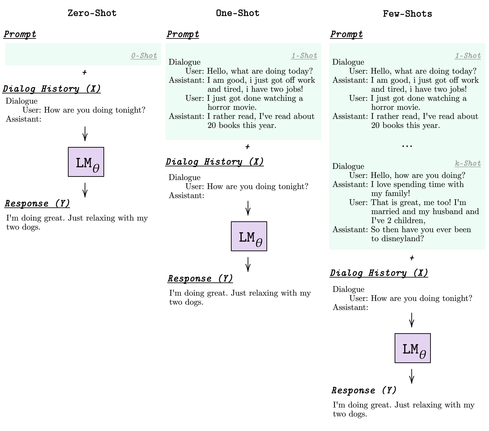

## Few-Shot Bot: Prompt-Based Learning for Dialogue Systems

Learning to converse using only a few examples is a great challenge in conversational AI. The current best conversational models, which are either good chit-chatters (e.g., BlenderBot) or goal-oriented systems (e.g., MinTL), are language models (LMs) fine-tuned on large conversational datasets. Training these models is expensive, both in terms of computational resources and time, and it is hard to keep them up to date with new conversational skills. A simple yet unexplored solution is prompt-based few-shot learning (Brown et al. 2020) which does not require gradient-based fine-tuning but instead uses a few examples in the LM context as the only source of learning. In this paper, we explore prompt-based few-shot learning in dialogue tasks. We benchmark LMs of different sizes in nine response generation tasks, which include four knowledge-grounded tasks, a task-oriented generations task, three open-chat tasks, and controlled stylistic generation, and five conversational parsing tasks, which include dialogue state tracking, graph path generation, persona information extraction, document retrieval, and internet query generation. The current largest released LM (GPT-J-6B) using prompt-based few-shot learning, and thus requiring no training, achieves competitive performance to fully trained state-of-the-art models. Moreover, we propose a novel prompt-based few-shot classifier, that also does not require any fine-tuning, to select the most appropriate prompt given a dialogue history. Finally, by combining the power of prompt-based few-shot learning and a Skill Selector, we create an end-to-end chatbot named the Few-Shot Bot (FSB), which automatically selects the most appropriate conversational skill, queries different knowledge bases or the internet, and uses the retrieved knowledge to generate a human-like response, all using only few dialogue examples per skill.



## Demo
There are two FSB modes: 1) controlled style generation (FSB-CG) and 2) full-model. 

### FSB-CG 
Check the [FSB-CG.ipynb](https://github.com/andreamad8/FSB/blob/main/FSB-CG.ipynb) to try to interact with FSB in your local machine, or try directly in colab at 
```
https://colab.research.google.com/drive/15hQv1V3Cs5kQVfLOE_FZc1VCWQ3YpWVd?usp=sharing
```
Remember to select the environment with GPU!! 

### FSB 
Check the [FSB.ipynb](https://github.com/andreamad8/FSB/blob/main/FSB.ipynb) to try to interact with FSB in your local machine, or try directly in colab at 
```
https://colab.research.google.com/drive/1JkPeX-6oXikiwWKqW5QkibEy8Oq6KM9g?usp=sharing
```
Remember to select the environment with GPU!! This current version does not query the Internet, Wiki and KGs, but only parse the dialogue history with MSC-parse. If you want to try the full version that query different KBs and uses all the skill they try:
```
python interact_full.py
```
This script loads GPT-J as default, and requires to have both the [search engine](https://github.com/andreamad8/FSB/tree/main/retrievers) and the [KG](https://github.com/HLTCHKUST/adapterbot/tree/main/retriever/graphdb) running. 

## How to cite
If you find this paper or code useful, please cite:

```
@article{madotto2021few,
  title={Few-Shot Bot: Prompt-Based Learning for Dialogue Systems},
  author={Madotto, Andrea and Lin, Zhaojiang and Winata, Genta Indra and Fung, Pascale},
  journal={arXiv preprint arXiv:2110.08118},
  year={2021}
}
```
